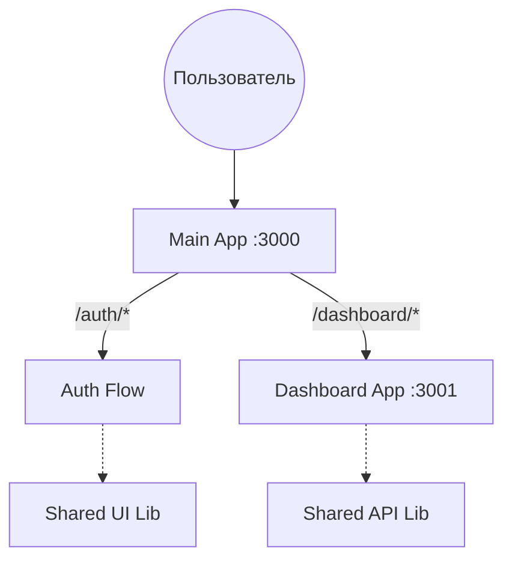

# ADR-001: Выбор Next.js Multi-Zones для масштабирования монорепозитория

**Статус:** Accepted  
**Дата:** 2026-04-25  
**Автор:** Antigravity/rbikbov

## 1. Контекст

Проект представляет собой монорепозиторий с несколькими независимыми приложениями (`main`, `dashboard`). Нам необходимо объединить их под единым доменом, обеспечив при этом независимость команд, циклов сборки и деплоя.

**Ограничения:**

- Необходимо сохранить возможность использования общих библиотек (`libs/shared`).
- Требуется минимизировать сложность локальной разработки (исключить поднятие локальных прокси-серверов типа Nginx).
- Нужно обеспечить работоспособность Auth-флоу (BFF) между приложениями.

## 2. Принятое решение

Использовать архитектуру **Next.js Multi-Zones** с конфигурацией роутинга через `rewrites` в основном приложении (`main`). Все приложения остаются независимыми зонами, но для браузера выглядят как единый проект.

## 3. Технические детали и механизмы

- **Маршрутизация**: Основное приложение (`apps/main`) выступает в роли "Proxy", перенаправляя запросы `domain.com/dashboard/:path*` (или `dashboard.domain.com`) на адрес второй зоны через `next.config.js`.
- **Шаринг кода**: Использование `transpilePackages` для прозрачного импорта `libs/shared` без предварительной сборки.
- **Стилизация**: Единая конфигурация Tailwind CSS v4 в `shared/ui`, которая сканирует контент всех зон для исключения дублирования стилей и обеспечения визуальной целостности.

## 4. Рассмотренные альтернативы

### 4.1. Проксирование через Nginx

- **Плюсы:** Технологическая независимость (можно добавить приложение на Vue).
- **Минусы:** Сложная локальная настройка, отсутствие интеграции с `next.config.js` и `rewrites`.
- **Решение:** Отклонено (избыточная сложность для монорепозитория на одном фреймворке).

### 4.2. Monolith (Все страницы в одном приложении)

- **Плюсы:** SPA-переходы, простая структура.
- **Минусы:** Раздутый бандл, невозможность независимого деплоя частей системы.
- **Решение:** Отклонено (противоречит целям масштабируемости).

### 4.3. Micro-frontends

- **Плюсы:** Технологическая независимость (можно добавить приложение на Vue).
- **Минусы:** Сложная настройка и интеграция между приложениями.
- **Решение:** Отклонено (избыточная сложность для монорепозитория на одном фреймворке).

## 5. Последствия и риски

### Положительные (Pros)

- Единый конфиг роутинга (`next.config.js`) как Source of Truth.
- Упрощенный деплой на Vercel/Netlify.
- Изоляция бандлов: падение одной зоны не ломает фронтенд другой.

### Отрицательные / Риски (Cons/Risks)

- **Hard Navigations**: Переходы между зонами требуют полной перезагрузки (использование `<a>` вместо `<Link>`).
- **Митигация**: Использование общих стилей и кеширования ассетов, чтобы визуально переход был максимально быстрым.

## 6. История ревизий

- **2026-04-25**: Первоначальное описание архитектуры (Antigravity)
- **2026-04-25**: Статус изменен на Accepted после обсуждения преимуществ перед Nginx.
- **2026-04-28**: Добавлен пункт 4.3. Micro-frontends и уточняющие правки.
