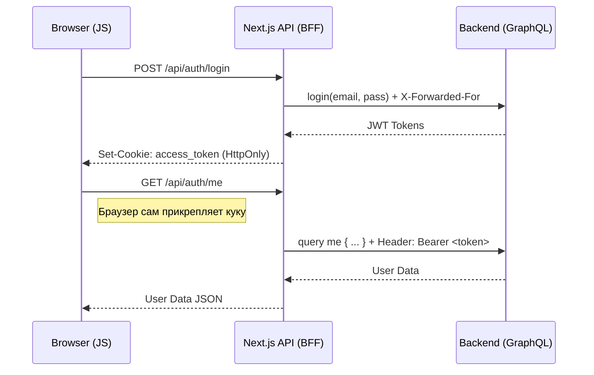

# ADR-002: Стратегия безопасной аутентификации (BFF + HttpOnly Cookies)

**Статус:** Accepted  
**Дата:** 2026-04-25  
**Автор:** Antigravity

## 1. Контекст

Нам необходимо реализовать систему аутентификации, которая защищена от распространенных атак (XSS, Session Hijacking) и при этом сохраняет возможность корректной работы Rate Limiting на стороне бекенда.

**Ограничения:**

- Нельзя хранить JWT токены в `localStorage` или `sessionStorage` (риск кражи через XSS).
- Бекенд не умеет самостоятельно выставлять безопасные куки (необходимо проксирование).
- Нужно пробрасывать реальный IP клиента через прокси.

## 2. Принятое решение

Внедрить паттерн **BFF (Backend-for-Frontend)** через Next.js Route Handlers. Токены хранятся исключительно в `HttpOnly`, `Secure`, `SameSite: Strict` куках. Браузерный JavaScript не имеет доступа к токенам.

## 3. Технические детали и механизмы

- **Proxy-роуты**: Реализованы `/api/auth/login`, `/api/auth/me`, `/api/auth/logout`.
- **IP Forwarding**: Каждый запрос от BFF к GraphQL бекенду включает заголовок `X-Forwarded-For` с IP-адресом оригинального клиента.
- **Refresh Logic**: Инкапсулирована внутри `GraphQLAuthApi` (shared lib), которая умеет автоматически обновлять токены через BFF при получении 401 ошибки.

## 4. Рассмотренные альтернативы

### 4.1. Хранение в LocalStorage

- **Плюсы:** Простота реализации, отсутствие серверного прокси.
- **Минусы:** Критическая уязвимость к XSS. Любой вредоносный скрипт может украсть сессию пользователя.
- **Решение:** Отклонено как небезопасное.

### 4.2. Прямое общение с бекендом через CORS

- **Плюсы:** Меньше задержка на проксирование.
- **Минусы:** Бекенд должен поддерживать сложные правила CORS и уметь работать с куками. Сложно пробрасывать IP для Rate Limit.
- **Решение:** Отклонено в пользу архитектурной гибкости BFF.

## 5. Последствия и риски

### Положительные (Pros)

- Высокий уровень безопасности (токены недоступны для JS).
- Удобство для фронтенд-разработчиков (не нужно вручную прикреплять токены к каждому запросу).
- Полный контроль над сессией на стороне сервера (BFF).

### Отрицательные / Риски (Cons/Risks)

- Небольшая накладная задержка на проксирование запросов через Next.js.
- Необходимость поддержки дополнительных API-роутов.

## 6. История ревизий

- **2026-04-25**: Создание документа (Antigravity)
- **2026-04-25**: Добавлена деталь про SameSite: Strict и X-Forwarded-For.
