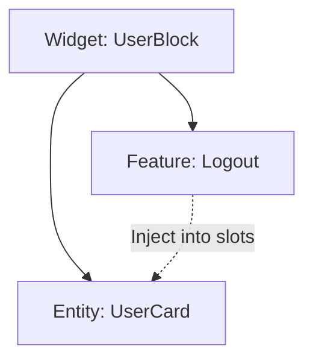

# ADR-003: Методология архитектуры (FSD) и инверсия зависимостей (deps)

**Статус:** Accepted  
**Дата:** 2026-04-25  
**Автор:** Antigravity/rbikbov

## 1. Контекст

При росте проекта классические структуры папок (`components/`, `services/`) превращаются в «клубок спагетти», где всё зависит от всего. Нам нужна расширяемая структура с четкими границами ответственности и отсутствием циклических зависимостей.

**Ограничения:**

- Нужно разделять бизнес-логику (Features) и визуальное представление (Entities).
- Нижние слои не должны знать о существовании верхних.
- Код должен быть легко тестируемым в изоляции (например, через Storybook).

## 2. Принятое решение

Использовать методологию **Feature-Slicing Methodology (FSD)** для организации кода. Для связи между слоями снизу-вверх (когда сущности нужно выполнить действие из фичи) использовать паттерн **Dependency Inversion (DI)** через пропсы (`deps`).

## 3. Технические детали и механизмы

- **Слои**: Shared (базис), Entities (бизнес-сущности), Features (действия), Widgets (композиция), Pages (страницы), App (настройка).
- **Public API**: Каждый модуль экспортирует только то, что необходимо, через `index.ts`. Глубокие импорты запрещены.
- **Паттерн deps**: Компоненты уровня Entities принимают функции рендеринга или обработчики событий как опциональные зависимости. Реальная логика «внедряется» в них на уровне вышестоящих слоев.

## 4. Рассмотренные альтернативы

### 4.1. Плоская структура (Components/Hooks)

- **Плюсы:** Быстрый старт на маленьких проектах.
- **Минусы:** Неуправляемый рост зависимостей, сложность рефакторинга.
- **Решение:** Отклонено из-за долгосрочных рисков.

### 4.2. Clean Architecture (с классами и контроллерами)

- **Плюсы:** Максимальная независимость от фреймворка.
- **Минусы:** Слишком много шаблонного кода для React-приложения.
- **Решение:** Отклонено в пользу более «фронтенд-ориентированного» FSD.

## 5. Последствия и риски

### Положительные (Pros)

- Высокая предсказуемость кода: всегда понятно, где искать логику ("кричащесть" архитектуры).
- Изоляция модулей: изменение одной фичи гарантированно не сломает другую.
- Упрощенный онбординг новых разработчиков.

### Отрицательные / Риски (Cons/Risks)

- Повышенный порог входа для тех, кто не знаком с FSD.
- Разное понимание FSD разными людьми, как следствие, требуется документирование договорённостей и следование им.
- Ощущение «избыточности» структуры на ранних этапах.

## 6. История ревизий

- **2026-04-25**: Создание документа (Antigravity)
- **2026-04-25**: Добавлен раздел про паттерн deps.
- **2026-04-28**: Уточняющие правки.
