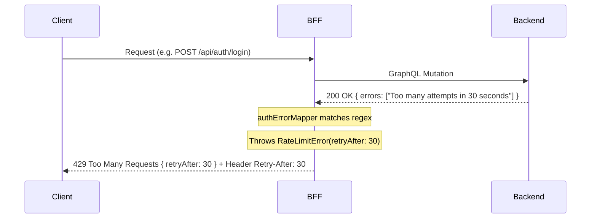

# ADR-004: Unified Error Handling and BFF Translation Strategy

**Статус:** Accepted  
**Дата:** 2026-05-02  
**Автор:** Antigravity

## 1. Контекст

Проект использует GraphQL в качестве основного протокола взаимодействия с бэкендом. Основная проблема заключается в том, что GraphQL по своей специфике возвращает статус `200 OK` даже в случае наличия ошибок в массиве `errors`. Это приводит к ряду проблем:

- Стандартные HTTP-инструменты мониторинга и логирования не видят ошибок.
- Браузерные интерцепторы и библиотеки (например, TanStack Query) не могут автоматически обрабатывать ошибки на основе статус-кодов.
- Клиентский код вынужден в каждом месте вручную парсить массив `errors` и пытаться отличить ошибку валидации от падения сервера.

**Ограничения:**

- Бэкенд может менять формулировки ошибок (например, "too many reset attempts" vs "too many login attempts").
- Необходимо поддерживать стандарты безопасности (Rate Limiting) и предоставлять пользователю информацию о времени блокировки.

## 2. Принятое решение

Реализовать **Единую систему маппинга и трансляции ошибок в слое BFF**.

BFF выступает в роли «семантического моста», который:

1. Выполняет GraphQL-запросы к бэкенду.
2. Анализирует массив `errors` с помощью гибких регулярных выражений (Error Mapper).
3. Приводит специфичные для протокола ошибки к доменным классам (`ApiError`, `RateLimitError` и т.д.).
4. Транслирует эти классы в семантически корректные HTTP-ответы (400, 429, 502) для фронтенда.

## 3. Технические детали и механизмы

### Классификация ошибок:

- **`ApiError`**: Ошибки бизнес-логики и валидации (неверный пароль, занятый email). Транслируется в **HTTP 400 Bad Request**.
- **`RateLimitError`**: Превышение лимита запросов. Транслируется в **HTTP 429 Too Many Requests**.
- **`NetworkError` / `ServiceUnavailableError`**: Проблемы со связью или падение бэкенда. Транслируются в **HTTP 502 Bad Gateway**.

### Механизм трансляции (BFF):

### Ключевые особенности:

- **Regex-based Mapping**: Маппер поддерживает захват групп (например, количество секунд ожидания), что позволяет извлекать динамические данные из текстовых сообщений бэкенда.
- **Retry-After Support**: Реализована поддержка стандартного заголовка `Retry-After` для ошибок типа 429.

## 4. Рассмотренные альтернативы

### 4.1. Обработка ошибок напрямую на клиенте

- **Плюсы:** Меньше логики на стороне BFF.
- **Минусы:** Дублирование логики парсинга в каждой фиче, невозможность использования стандартных HTTP-статусов в Network Tab, сложность централизованного обновления паттернов ошибок.
- **Решение:** Отклонено.

### 4.2. Использование универсального 500 статуса

- **Плюсы:** Максимальная простота реализации.
- **Минусы:** Плохой UX (невозможно подсветить конкретные поля формы), затрудненная отладка.
- **Решение:** Отклонено.

## 5. Последствия и риски

### Положительные (Pros)

- Чистый клиентский код: компоненты работают с типизированными ошибками и стандартными статусами.
- Прозрачный мониторинг: Sentry и другие инструменты корректно группируют ошибки по HTTP-статусам.
- Гибкость: при изменении текстов на бэкенде достаточно поправить один регуляр в маппере.

### Отрицательные / Риски (Cons/Risks)

- Усложнение BFF: слой API-роутов становится более нагруженным логикой.
- Риск «промаха» регулярки: если бэкенд пришлет совершенно новый текст ошибки, он может упасть в `GENERIC_ERROR`.
- **Митигация:** Написание Unit-тестов на `auth-error-mapper` для покрытия всех известных паттернов ответов бэкенда.

## 6. История ревизий (Revision History)

- **2026-05-02**: Первоначальная версия документа (Antigravity).
- **2026-05-02**: Статус изменен на Accepted.
